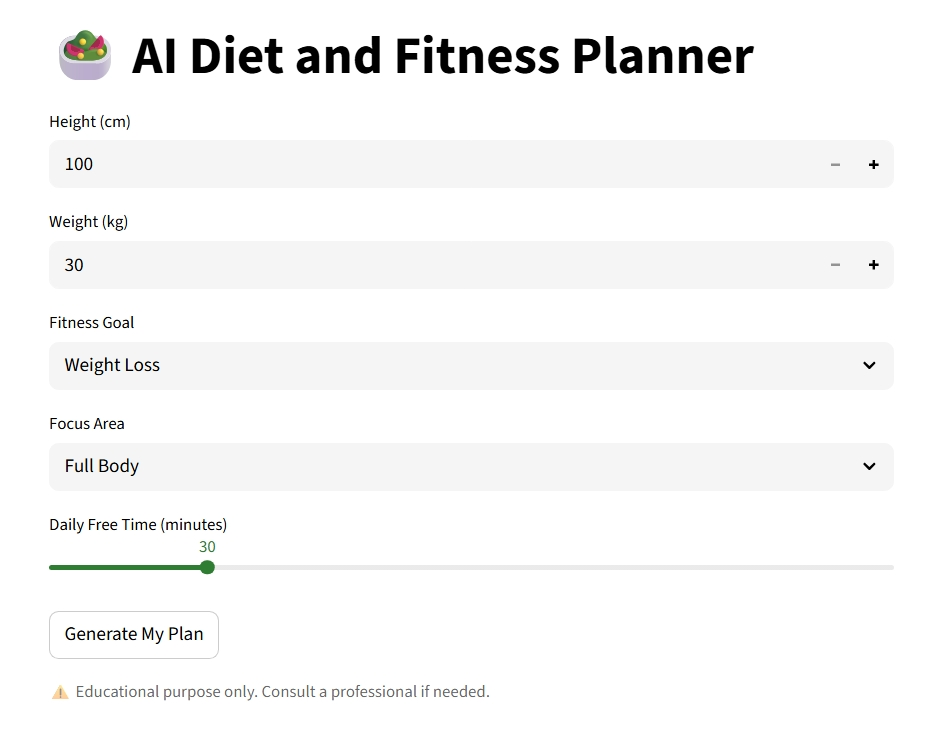
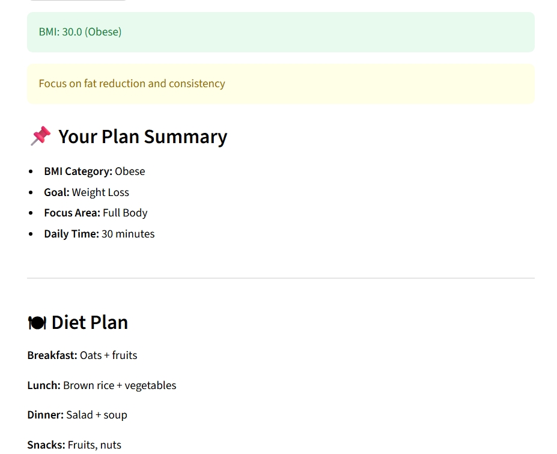
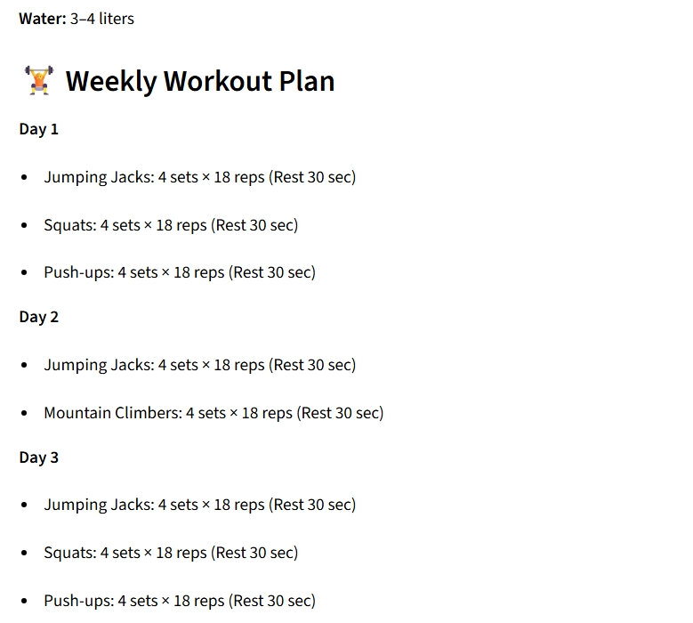
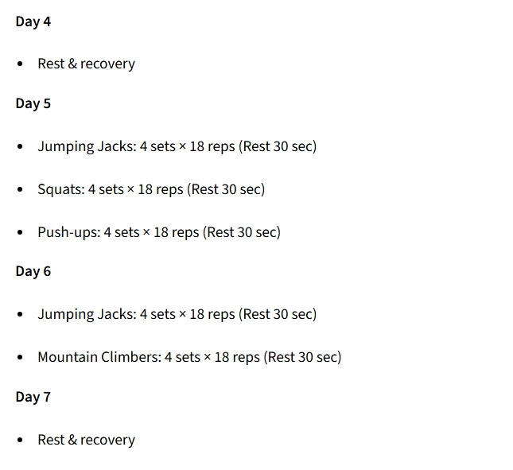
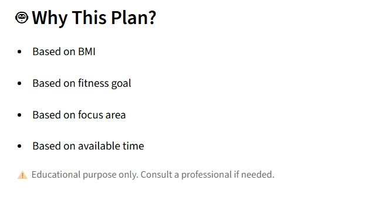

# 🥗 AI Diet and Fitness Planner

An AI-powered personalized **Diet & Workout Planner** built using **Python and Streamlit**.  
The application generates **custom diet plans and weekly workout routines** based on:

- BMI category  
- Fitness goal (Weight Loss / Maintain / Weight Gain)  
- Focus area (Arms, Legs, Upper Body, Lower Body, Full Body)  
- Daily free time availability  

---

## 🚀 Features

✅ BMI Calculation & Category Detection  
✅ Personalized Diet Plan (Breakfast, Lunch, Dinner, Snacks)  
✅ Weekly Workout Split (7-day plan)  
✅ Adjustable Sets, Reps & Rest based on:
- Goal  
- BMI  
- Free Time  

✅ Safety Warnings for unhealthy goal selections  
✅ Clean & Simple UI (Light Mode)

---

## 🧠 Logic Used

### Why this plan?
- Based on **BMI**
- Based on **Fitness Goal**
- Based on **Selected Focus Area**
- Based on **Daily Free Time**

⚠️ Safety checks prevent:
- Underweight users choosing weight loss  
- Overweight/Obese users choosing weight gain  

---

## 📂 Project Structure

```text
AI_Fitness_Diet_Planner/
│
├── app.py                      # Main Streamlit app
│
├── models/
│   └── bmi_model.py            # BMI calculation logic
│
├── logic/
│   ├── diet_planner.py         # Diet recommendation logic
│   └── workout_split_planner.py# Weekly workout split logic
│
├── datasets/
│   └── indian_food.csv         # Nutrition dataset
│
├── screenshots/
│   ├── pg1.jpeg
│   ├── pg2.jpeg
│   ├── pg3.jpeg
│   ├── pg4.jpeg
│   └── pg5.jpeg
│
├── .gitignore
└── README.md
```

---

## ▶️ How to Run the App

### 1️⃣ Open terminal in project folder

python -m venv venv
venv\Scripts\activate
pip install streamlit pandas numpy
### 2️⃣ Run the app
streamlit run app.py

---


## 🧪 Technologies Used
-Python
-Streamlit
-Pandas
-NumPy


---


## 📸 Application Screenshots

### 🏠 Home Page


### 🍽 Diet Plan Output


### 🏋️ Workout Plan Output



### ℹ️ Description Output


---


⚠️ Disclaimer
This application is for educational purposes only.
Please consult a certified fitness or medical professional before following any plan.


---


👨‍🎓 Project Info
Academic Project – AI / ML
Designed for students and beginners 2learning applied AI.
